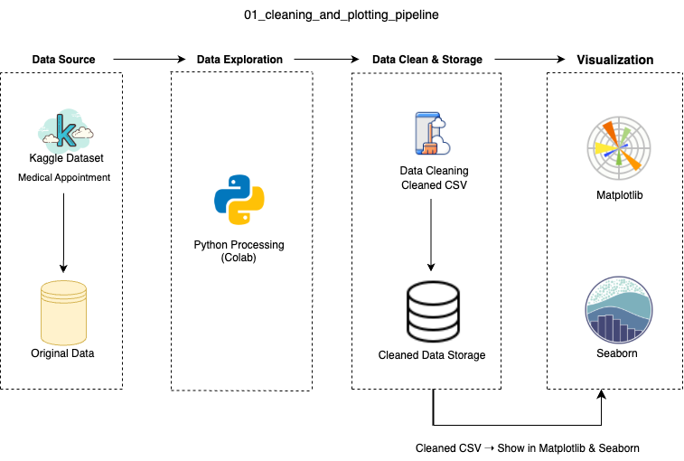

## Overview 项目总览
  
A basic Python project for teaching data cleaning and visualization. This project uses a real-world medical appointment dataset from Kaggle to demonstrate how to process raw CSV data and create clear static visualizations using seaborn and matplotlib.

** 中文说明（项目简介）** 本项目是一个教学型数据清洗与可视化示例，使用来自 Kaggle 的巴西的医疗预约数据，展示如何利用 Python（pandas + seaborn + matplotlib）完成从原始数据处理到图表输出的完整流程。项目特别适合作为助教展示或初学者教学材料，支持 Google Colab 与本地运行。

## Project Summary 项目摘要

** Goal|目标 ** Teach basic data cleaning and plotting using Python  
  使用 Python 教学演示基础的数据清洗与可视化流程  
** Tools|工具 ** pandas, seaborn, matplotlib  
  使用 Python 中的常见数据处理与图形库  
** Output|输出 ** Cleaned CSV and 4 static PNG charts  
  产出包括清洗后的 CSV 和四张静态图像  
** Audience|受众 ** Students or teaching assistants learning data pipelines  
  面向数据处理初学者或教学助理使用

## Dataset 数据集说明

** Source|来源 ** Kaggle – [Medical Appointment No Shows](https://www.kaggle.com/datasets/joniarroba/noshowappointments)  
** Original File|原始文件 ** `raw_appointments.csv`  
** Cleaned Version|清洗后文件 ** `appointments_cleaned.csv`

The dataset contains medical appointment records, including demographic information and whether the patient showed up.

** 中文说明 **：数据集包含医院挂号信息与病人爽约标记，适合教学二分类建模或行为特征分析。

## Data Visualization 数据可视化

Below are the final visualizations generated from the cleaned CSV:

** 中文说明 **：以下是基于清洗后的数据文件（`appointments_cleaned.csv`）所生成的最终可视化图像：

| Chart Title (EN)                  | 文件名                        | 中文说明                             |
|----------------------------------|-------------------------------|--------------------------------------|
| No-Show Rate by Gender           | `no_show_by_gender.png`       | 按性别展示爽约率                     |
| No-Show Rate by Age Group        | `no_show_by_age_group.png`    | 不同年龄段的爽约率分布               |
| No-Show Rate by Day of Week      | `no_show_by_dayofweek.png`    | 按星期几统计爽约趋势                 |
| No-Show Rate by SMS Notification | `no_show_by_sms.png`          | 收到短信提醒 vs 爽约率关系           |

All charts are generated using `seaborn` and saved via `matplotlib.pyplot.savefig()`.

** 中文说明 ** 所有图像均由 Python 可视化库 `seaborn` 绘制，并通过 `matplotlib.pyplot.savefig()` 保存为静态 PNG 文件，适合教学展示与报告嵌入使用。

## Data Architecture 数据流程图

** Flow 数据流说明 ** Kaggle CSV → Python 清洗 → 输出 CSV → Python 可视化 → 静态图像

## Prerequisites 环境依赖
  
- Python 3.x
  * 请确保你的本地或 Colab 环境为 Python 3 版本。   
- Install the required libraries:
  * 安装本项目所需的依赖库：    
- pip install pandas matplotlib seaborn
  * 依次安装 pandas（数据处理库）、matplotlib（图像绘制库）、seaborn（统计图表库）

## How to Run This Project 如何运行本项目

- Clean the raw dataset (if applicable)
  python clean_data.py
  * 第一步，运行数据清洗脚本，生成干净的 CSV 文件
- Generate visualizations
  python visualize.py
  * 第二步，运行可视化脚本，自动输出图像文件 
- Cleaned file: appointments_cleaned.csv
  * 清洗后的数据文件（CSV 格式） 
- Output images: 4 PNG files in the same folder
  * 4 张图像（PNG 格式）将保存在当前目录下
- This project can be executed both on Google Colab and local Jupyter Notebook.
  * 所有脚本支持在 Google Colab 中直接运行，同时也兼容本地 Jupyter Notebook 环境。只需确保 Python 3.x 与相关库已正确安装，即可在本地复现全部流程与输出结果。
  
## Lessons Learned 教学亮点

How to group and bin continuous variables using pd.cut()

** 如何对连续变量进行分组
   
How to compute custom aggregation (e.g., no-show rate) in seaborn

** 如何自定义聚合计算（如爽约率）
   
How to style and export professional-quality static charts using Python

** 如何输出教学级别的高质量静态图像
