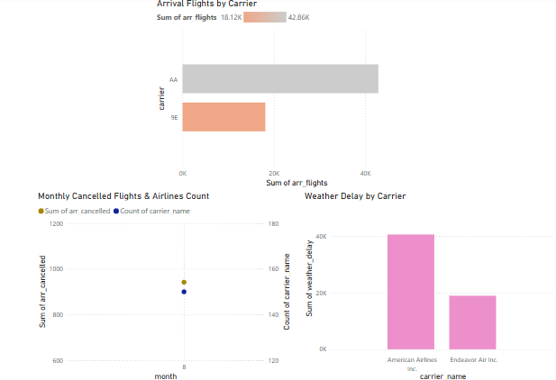
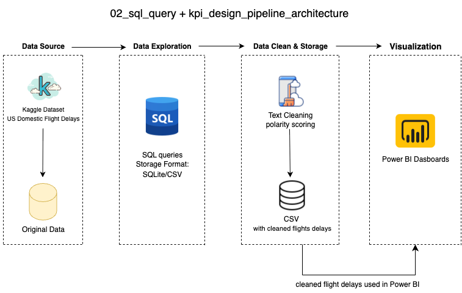

## Overview 项目总览

A lightweight SQL + Power BI project designed for teaching KPI query logic and dashboard design. It uses cleaned flight delay data to demonstrate how to write business-relevant SQL queries and turn them into interactive Power BI visuals.

** 中文说明 ** 本项目是一个轻量级的教学型项目，采用 SQL 和 Power BI 组合。项目以航空环境延迟数据为根基，教学如何编写商业目标相关的 SQL 查询，并转换成可视化数据抽象与交互。

## Project Summary 项目摘要

** Goal|目标 ** Teach SQL-based KPI query and dashboard reporting logicSQL 教学主题，培养商业指标设计与数据抽象能力

** Tools|工具 ** SQLite, Power BI

** Output|输出 ** SQL scripts and 3 Power BI visualizations

** Audience|面向人群 ** Data learners or classroom teaching demonstrations

## Dataset 数据集说明

** Source|数据来源 ** Kaggle 网站 — U.S. Flight Delay Causes

** Original File|原始文件 ** Airline_Delay_Cause.csv

** Cleaned Version|清洗后文件 ** clean_flight_delays_teaching.csv

数据包含内容：有关美国航空公司延迟原因、每月航班量、时间分布和各类指标。

** 中文说明 ** 适合教学 SQL 小项目，包含多个统计时点和 KPI 查询组合场景

## Data Visualization 数据可视化

Below are the final dashboard visualizations created in Power BI: ** 中文说明 ** 以下三张图表为基于 SQL 查询输出结果的 Power BI 数据抽象图：

## Data Architecture 数据编排流程

** 中文说明 ** Flow 数据流程：Kaggle CSV 数据 → 本地清洗 → SQLite SQL 查询 → Power BI 数据可视化

## SQL Query 规范 SQL 查询

The full script is available in sql_query_kpi.sql. Below is one example:

** 中文说明 ** 完整 SQL 脚本请参见 sql_query_kpi.sql 文件，以下是其中一个示例查询：

SELECT month, SUM(arr_flights) AS total_arrivals
FROM flight_delays
GROUP BY month
ORDER BY month ASC;

## Prerequisites 环境依赖

SQLite3 (any SQL engine with CSV import ability)

** 中文说明 ** SQLite3：轻量级关系型数据库系统，适合快速加载和查询本地 CSV 数据；也可替代为任何支持 CSV 导入的 SQL 引擎（如 PostgreSQL、MySQL）

Power BI Desktop or Power BI Service

** 中文说明 ** 微软推出的数据可视化与商业智能工具，支持构建交互式仪表板，适用于教学演示与实际业务场景。

## How to Run This Project 如何运行本项目

Load clean_flight_delays_teaching.csv into a SQLite database (or Excel/Power BI directly)

** 中文说明 ** 将 clean_flight_delays_teaching.csv 导入到 SQLite 数据库中（也可直接在 Excel 或 Power BI 中加载此 CSV 文件）

Use sql_query_kpi.sql to perform KPI queries

** 中文说明 ** 使用提供的 SQL 脚本 sql_query_kpi.sql 执行关键绩效指标（KPI）相关查询

Visualize outputs in Power BI using 3 suggested chart structures

** 中文说明 ** 在 Power BI 中基于 SQL 查询结果构建三个推荐图表，完成 KPI 指标的可视化展示

## Lessons Learned 教学亮点

How to aggregate monthly KPIs from raw airline data

** 中文说明 ** 如何从原始航空数据中聚合出月度关键绩效指标（KPI）

How to use stacked column and combo charts effectively in Power BI

** 中文说明 ** 如何在 Power BI 中有效使用堆叠柱状图与组合图（如双 Y 轴图表）

How to design visual layouts for comparing delay reasons and time trends

** 中文说明 ** 如何设计图表布局以对比延误原因与时间变化趋势
