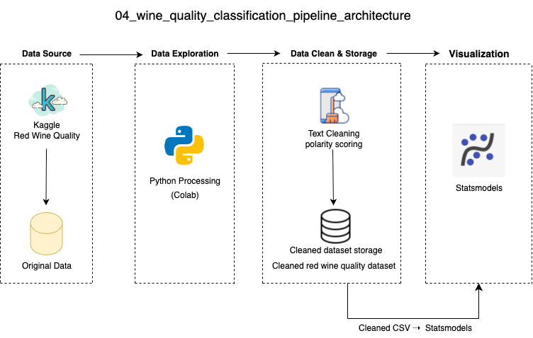

## Overview 项目总览

A basic Python project demonstrating how to build a binary classification model using logistic regression. This project uses a wine quality dataset to show how interpretable models can be used in teaching binary classification logic.

** 中文说明 **  本项目是一个逻辑回归二分类教学示例，使用葡萄酒质量评分数据构建模型，演示如何用 Python 和 statsmodels 实现一个结构清晰、便于教学讲解的分类流程。

## Project Summary 项目摘要

** Goal | 目标 **  Teach binary classification using logistic regression with interpretable model output  
通过逻辑回归模型讲解二分类建模的基本流程与模型解释方法  

** Tools | 工具 **  pandas, statsmodels, matplotlib, seaborn, scikit-learn  
使用 Python 进行数据处理、模型训练与可视化分析  

** Output | 输出 **  Confusion matrix plot, classification report, and model summary  
输出混淆矩阵图、分类评估报告与 statsmodels 模型摘要  

** Audience | 受众 **  Students or instructors learning classification modeling  
面向学习机器学习基础或逻辑回归建模的学生与教学人员

## Dataset 数据集说明

** Source | 来源 **  [Wine Quality Dataset – UCI Repository / Kaggle](https://www.kaggle.com/datasets/rajyellow46/wine-quality)
** Original File | 原始文件 **  `wine_quality_classification_raw.csv`  
** Cleaned Version | 清洗后文件 **  `wine_quality_cleaned.csv`  
- The dataset contains physicochemical indicators and quality scores of wines.  
  A binary label is created: wines rated ≥ 6 are labeled as "good" (1), otherwise "average" (0).
  * 数据集包含葡萄酒的理化指标与质量评分。我们将评分 ≥ 6 的样本标为优质酒（1），其余为普通酒（0），以构建二分类任务。

## Data Visualization 数据可视化


## Data Architecture 数据流程图



Raw CSV → Data Cleaning → Logistic Regression → Evaluation → Confusion Matrix & Report

原始数据 → 数据清洗 → 构建逻辑回归模型 → 评估性能 → 混淆矩阵与指标输出

## Prerequisites 环境依赖

- Python 3.x  
  Make sure your local or Colab environment runs Python 3.
  * 请确保你的本地或 Google Colab 环境为 Python 3 版本。

- Install required libraries:
  pip install pandas statsmodels 
  * 请安装以下 Python 库：用于数据处理（pandas）、逻辑回归建模（statsmodels）、可视化（matplotlib & seaborn）和评估指标（scikit-learn）。

## How to Run This Project 如何运行本项目

- Upload the dataset and two scripts into your environment
   * 上传原始数据与 两个 Python 脚本至 Colab 或本地环境
- Run the cleaning script: python clean_model.py
   * 运行数据清洗脚本：python clean_data.py 该脚本将生成清洗后的数据文件：wine_quality_cleaned.csv，用于后续模型训练。 
   ```bash
   python clean_data.py
   ```
- This will generate a cleaned file: wine_quality_cleaned.csv
   * 该操作将生成一个清洗后的数据文件：wine_quality_cleaned.csv。
- Run the classification model: python classification_model.py
   * 运行分类模型脚本：python classification_model.py 该脚本将训练逻辑回归模型，并输出模型摘要、分类评估指标和混淆矩阵图。 
   ```bash
   classification_model.py
   ```
- Output show the Confusion Matrix in statsmodels
   * 输出结果中包含由 statsmodels 模型产生的混淆矩阵。 
- This will output model summary, classification report, and confusion matrix plot
   * 数据清洗脚本会创建一个二分类标签，并保存为清洗后的数据文件。
- The model script will output the statsmodels summary, classification performance metrics, and save a confusion matrix plot as wine_classification_plot.png.
   * 模型脚本将输出 statsmodels 模型摘要、分类性能指标，并保存混淆矩阵图像 wine_classification_plot.png
- All scripts work in Google Colab and local Jupyter environments.
   * 所有脚本支持在 Google Colab 中运行，也兼容本地 Jupyter Notebook，只需确保环境配置正确即可完整复现项目流程。

## Lessons Learned 教学亮点

- How to convert numerical labels into binary classification targets
   * 如何将评分数据转化为二分类标签
- How to train interpretable logistic regression using statsmodels
   * 如何使用 statsmodels 训练可解释的逻辑回归模型
- How to visualize model results with confusion matrix and classification report
   * 如何使用混淆矩阵和分类报告进行模型评估与可视化
- How to structure a teaching-oriented classification project
   * 如何构建一个适合教学演示的数据建模项目结构
